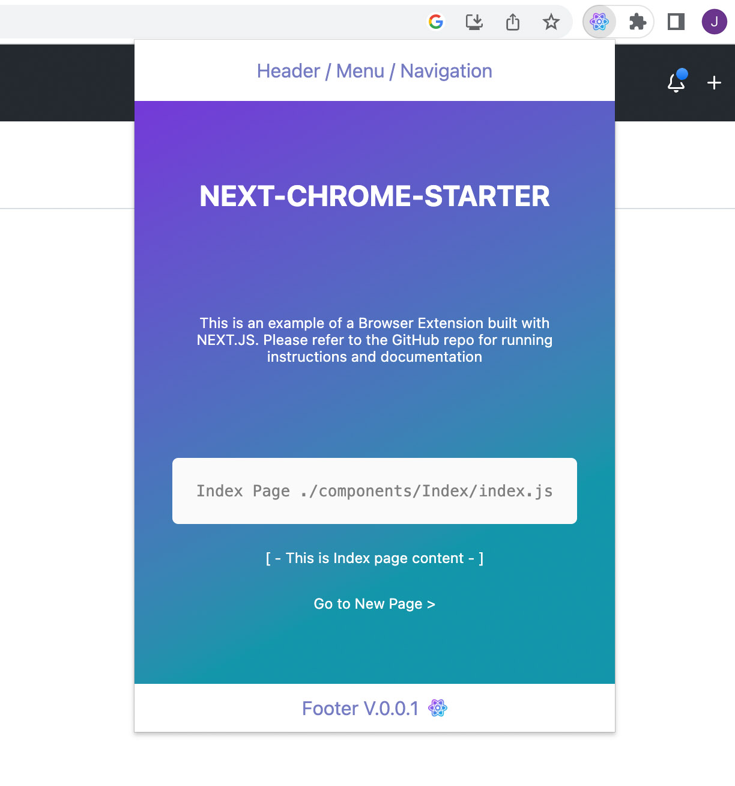
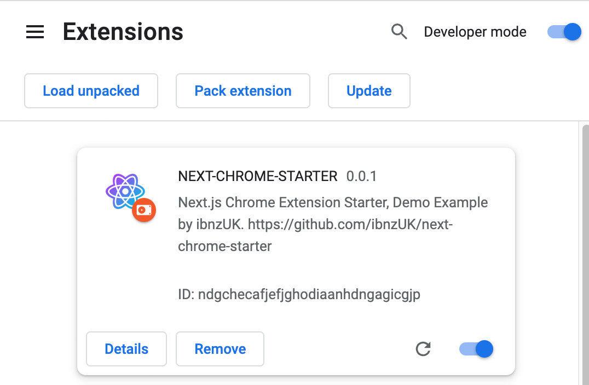

# Next.js Chrome Extension Starter  🚀  

Next.js Chrome Extension Starter is a demo example application that demonstrates how to build a Chrome extension using Next.js.

## Table of Contents ✨  

- [Description](#description)
- [Installation](#installation)
- [Usage](#usage)
- [Contributing](#contributing)
- [License](#license)

# Description

The Next.js Chrome Extension Starter provides a foundation for building Chrome extensions using Next.js, React, and other related technologies. It showcases the integration of Next.js and Chrome extension development by demonstrating a simple application with multiple pages.




# Installation

To install and run Next.js Chrome Extension Starter locally, follow these steps:

1. Clone this repository: 

   ```bash
   git clone https://github.com/ibnzUK/next-chrome-starter.git
   ```
2. Navigate to project directory: 

   ```
   cd next-chrome-starter
   ```
3. Navigate to project directory: 

   ```
   cd next-chrome-starter
   ```
4. Install the dependencies using npm: 
   ```
   npm install
   ```

# Usage
## Usage Locally  🔥
To run the Next.js Chrome Extension Starter locally, follow these steps:

Run the project:
```
npm run dev
```
`This will run project on your localhost`

 http://localhost:3000/

## Build and Import To Chrome 🔥
To build and import Next.js Chrome Extension Starter to chrome browser, follow these steps:

1. Build the project:
```
npm run build
```
`This will run prep and export to create new folder 'out/', and rename '_next' forlder to 'next' (without underscore)`

2. Open Google Chrome and go to chrome://extensions.


3. Enable the "Developer mode" toggle switch.

4. Click on "Load unpacked" and select the out folder generated by the build process.

5. The Next.js Chrome Extension Starter should now be loaded as an unpacked extension in Google Chrome.




# Contributing
Contributions to the Next.js Chrome Extension Starter are welcome! If you find any issues or have suggestions for improvements, please feel free to open an issue or submit a pull request.
